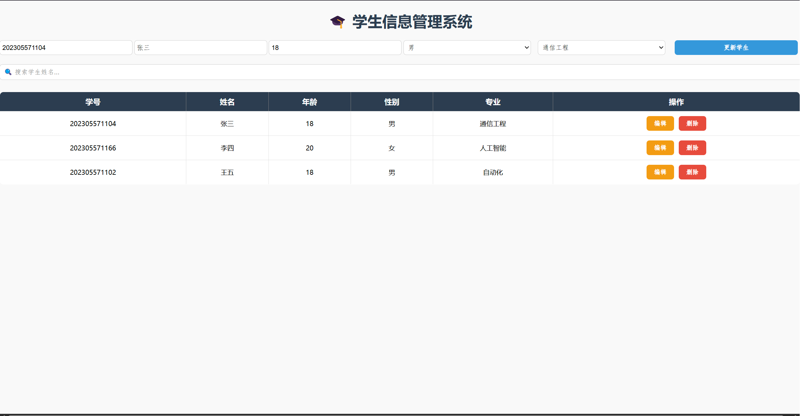
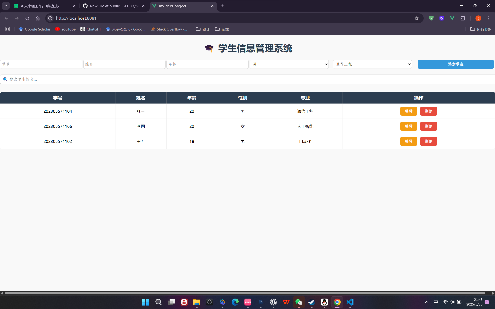
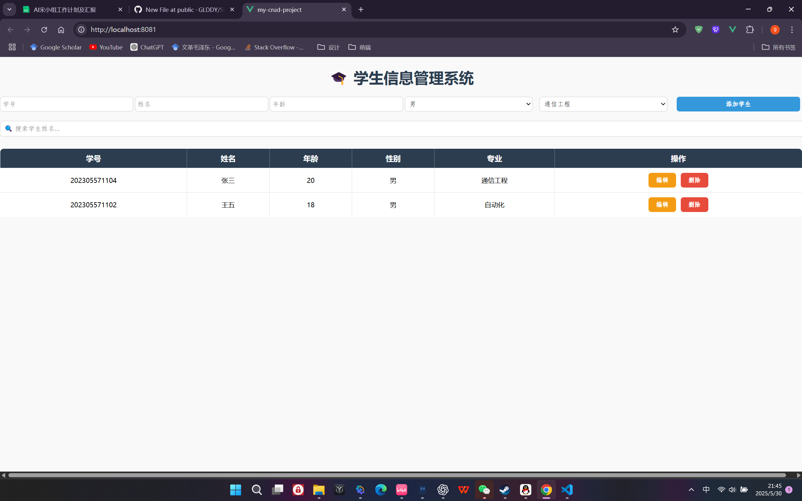
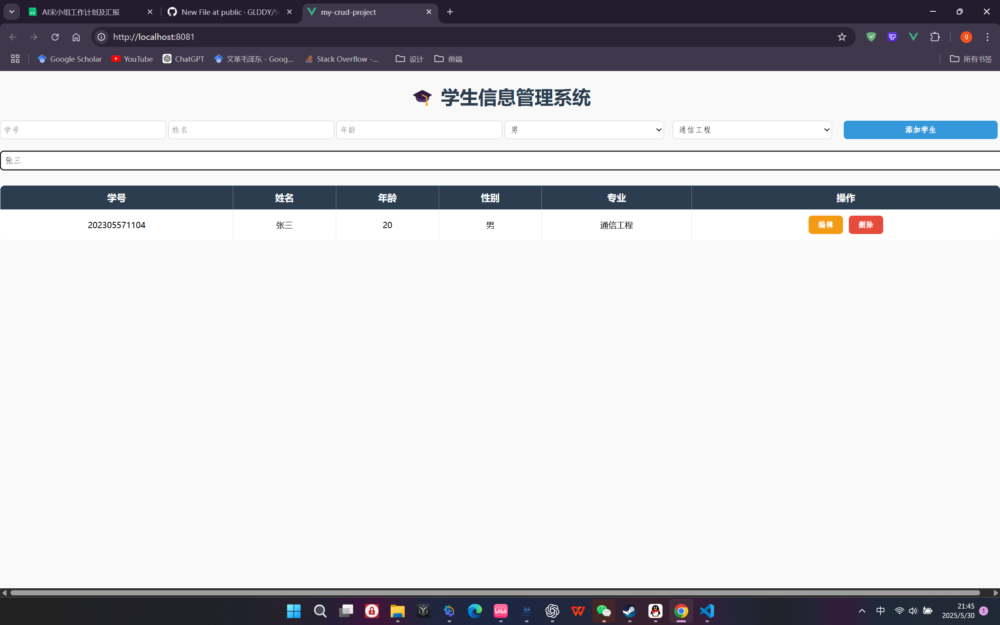

# 🎓 学生信息管理系统（Vue3 + Options API）

本项目是一个基于 Vue3 的前端练习小项目，主要实现了学生信息的增删改查功能（CRUD），采用 JSON 模拟后端数据。适合前端初学者练习 Vue 基础与组件设计思路。

📍 项目地址：https://github.com/GLDDY/SCRUD

---

## ✨ 项目功能

- ✅ 显示学生信息列表（表格形式）
- ➕ 添加学生信息
- 📝 编辑学生信息（支持取消编辑）
- ❌ 删除学生信息
- 🔍 按姓名关键字搜索
- 🎨 页面初步美化，适合“学院风”展示风格

---

## 📚 学生信息字段

| 字段   | 类型   | 说明                         |
|--------|--------|------------------------------|
| 学号   | String | 必填，唯一标识               |
| 姓名   | String | 必填                         |
| 年龄   | Number | 必填                         |
| 性别   | String | 男 / 女                      |
| 专业   | String | 通信工程 / 人工智能 / 电子信息工程 / 自动化 |

---

## 🛠 技术栈

- [Vue 3](https://vuejs.org/)（基于 Options API）
- HTML / CSS / JavaScript
- JSON 模拟本地数据
- Vue Cli 构建工具

---

## 🖼️ 页面截图

### 📋 学生信息展示界面


### ➕ 添加学生界面


### 📝 编辑状态界面



### ❌ 删除功能演示


### 🔍 搜索功能效果


---

## 🚀 快速启动

```bash
# 克隆项目
git clone https://github.com/GLDDY/SCRUD.git

# 进入目录
cd SCRUD

# 安装依赖
npm install

# 启动项目
npm run dev
