# 智能家庭视频监控系统 - 答辩总结文档

## 一、项目概述

### 1.1 项目背景
本项目是湘潭大学通信工程专业网络程序设计实训课程的实践项目，旨在开发一个基于嵌入式Linux平台的智能家庭视频监控系统。该系统实现了实时视频采集、网络传输和远程监控的完整功能。

### 1.2 项目目标
- 掌握嵌入式Linux环境下的程序开发技能
- 实现基于TCP/IP协议的网络视频传输
- 熟悉V4L2（Video for Linux 2）摄像头编程接口
- 掌握多线程并发编程和资源同步技术
- 实现触摸屏交互和LCD显示功能

### 1.3 技术架构
**开发环境：**
- 服务器端：ARM Linux开发板
- 客户端：x86 PC端
- 编译器：arm-linux-gcc（交叉编译）/ gcc（本地编译）
- 编程语言：C语言
- 网络协议：TCP/IP

**系统架构：**

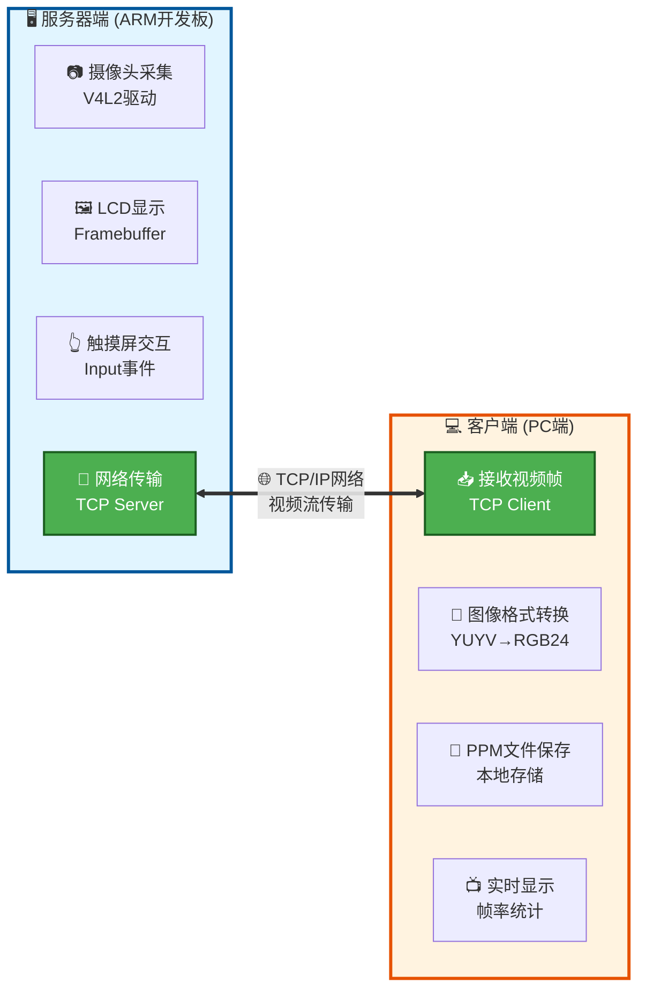

---

## 二、系统功能模块

### 2.1 服务器端模块

#### 2.1.1 主控模块 (main.c)
**功能描述：**
- 系统初始化和启动流程控制
- 信号处理（SIGINT、SIGTERM）
- LCD显示初始化
- 触摸屏交互（检测"进入"按钮点击）

**核心代码逻辑：**

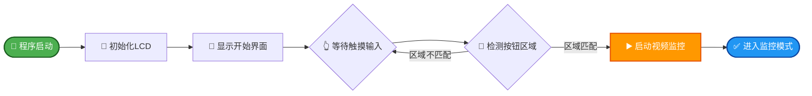

#### 2.1.2 摄像头模块 (camera.c/camera_module.c)
**功能描述：**
- V4L2摄像头设备初始化
- 视频格式设置（640×480 YUYV格式）
- 内存映射缓冲区管理（mmap）
- 帧数据采集和队列管理
- YUYV到RGB格式转换
- 实时视频预览到LCD

**关键技术：**
- 使用ioctl系统调用控制摄像头设备
- 采用内存映射方式提高数据传输效率
- 实现YUYV422到RGB565的颜色空间转换

#### 2.1.3 网络服务模块 (server_module.c/video_server.c)
**功能描述：**
- TCP服务器创建和监听（默认端口8888）
- 多客户端并发连接管理
- 视频帧数据封装和传输
- 线程安全的资源访问控制

**数据包格式：**
```c
typedef struct {
    unsigned int magic;       // 魔数: 0x12345678
    unsigned int frame_size;  // 帧数据大小
    unsigned int width;       // 图像宽度: 640
    unsigned int height;      // 图像高度: 480
    unsigned int format;      // 图像格式: 0=YUYV
    unsigned int timestamp;   // 时间戳
} frame_header_t;
```

**传输流程：**

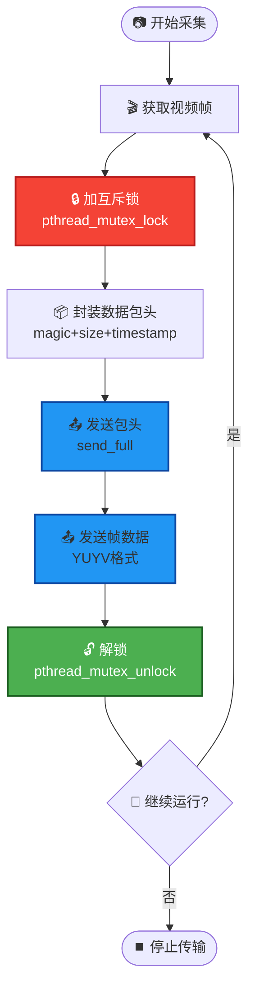

#### 2.1.4 显示模块 (lcd.c/bmp.c)
**功能描述：**
- LCD framebuffer设备初始化
- BMP图像文件解析和显示
- 实时视频帧渲染到LCD屏幕

#### 2.1.5 触摸屏模块 (ts.c)
**功能描述：**
- 触摸屏输入设备打开
- 触摸坐标读取和校准
- 按钮区域检测（280-520, 270-460）

### 2.2 客户端模块

#### 2.2.1 视频接收客户端 (video_client.c)
**功能描述：**
- 连接到服务器（IP地址和端口参数）
- 接收视频帧数据包
- YUYV到RGB24格式转换
- 保存为PPM图像文件（frame_XXXX.ppm）
- 实时显示帧率统计信息

**核心功能：**

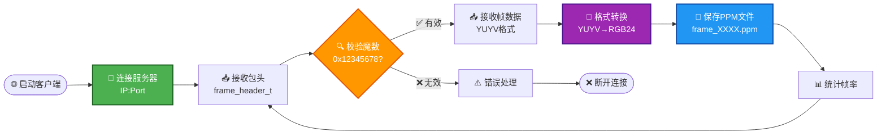

---

## 三、核心技术实现

### 3.1 多线程并发控制
**问题：** 多个客户端同时访问摄像头资源可能导致数据竞争

**解决方案：**
```c
pthread_mutex_t camera_mutex = PTHREAD_MUTEX_INITIALIZER;

// 在访问摄像头前加锁
pthread_mutex_lock(&camera_mutex);
camera_get_frame(g_camera, &yuyv_data, &data_size);
pthread_mutex_unlock(&camera_mutex);
```

### 3.2 可靠数据传输
**问题：** TCP传输中send/recv可能只传输部分数据

**解决方案：** 实现完整数据收发函数
```c
int send_full(int sock, const void *data, size_t size) {
    size_t sent = 0;
    while (sent < size) {
        int n = send(sock, data + sent, size - sent, 0);
        if (n < 0) return -1;
        sent += n;
    }
    return 0;
}
```

### 3.3 信号处理与优雅退出
**实现：**
```c
void signal_handler(int sig) {
    g_running = 0;
    if (g_server_fd >= 0) {
        close(g_server_fd);  // 中断accept调用
    }
}

signal(SIGINT, signal_handler);
signal(SIGTERM, signal_handler);
```

### 3.4 V4L2摄像头编程

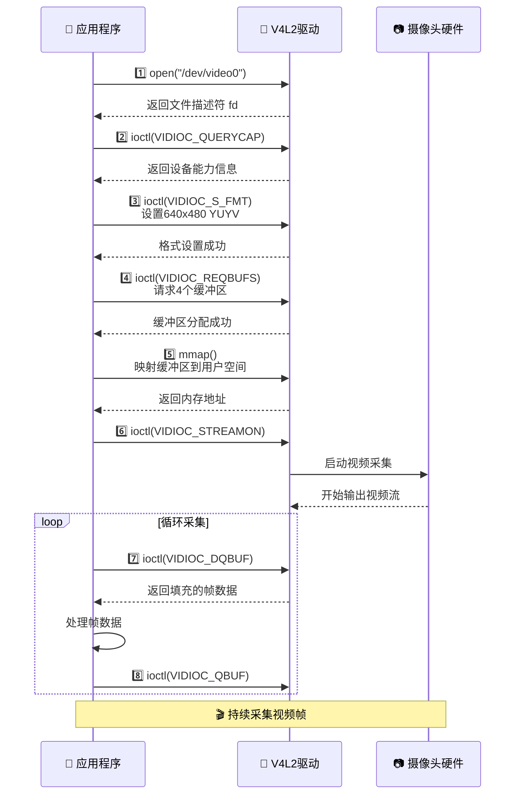

---

## 四、项目成果总结

### 4.1 功能实现情况

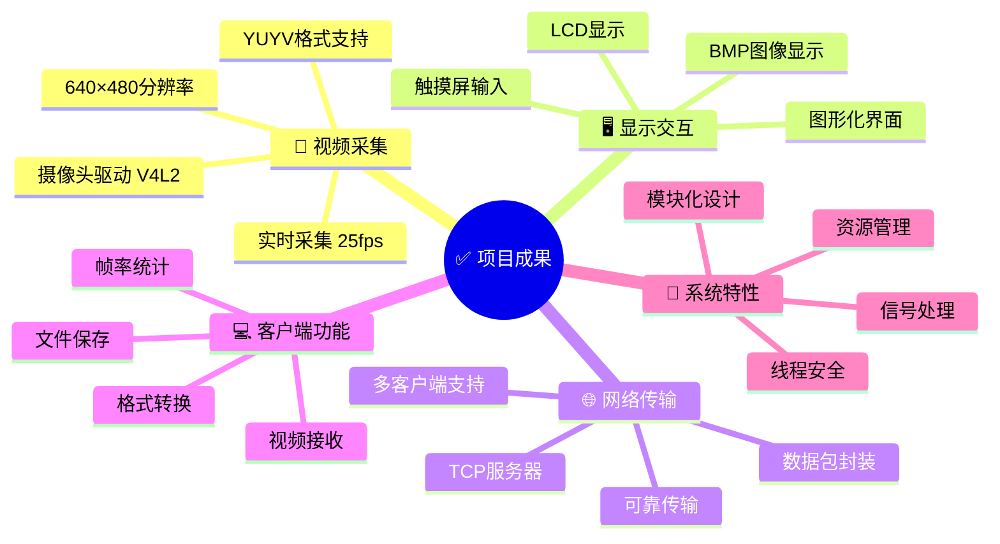

✅ **已完成功能清单：**
1. ✅ 摄像头实时视频采集（640×480 @ 25fps）
2. ✅ LCD显示和触摸屏交互
3. ✅ TCP网络服务器搭建
4. ✅ 多客户端并发连接支持
5. ✅ 视频流网络传输
6. ✅ 客户端视频接收和保存
7. ✅ 颜色格式转换（YUYV→RGB）
8. ✅ 信号处理和资源释放
9. ✅ 线程安全控制
10. ✅ 模块化代码结构

### 4.2 技术指标

| 指标项     | 实现情况          |
| ---------- | ----------------- |
| 视频分辨率 | 640×480像素       |
| 帧率       | 25-30 FPS         |
| 视频格式   | YUYV422 / RGB24   |
| 网络协议   | TCP/IP            |
| 并发连接数 | 支持多客户端      |
| 传输延迟   | < 200ms（局域网） |
| 代码行数   | 约2000+行         |
| 模块数量   | 12个模块          |

### 4.3 项目亮点

**1. 模块化设计**
- 清晰的模块划分（摄像头、网络、显示、交互）
- 良好的代码复用性和可维护性
- 头文件和源文件分离

**2. 并发处理能力**
- 每个客户端独立线程处理
- 互斥锁保护共享资源
- 高效的资源利用

**3. 健壮性设计**
- 完善的错误处理机制
- 信号处理确保资源释放
- 网络异常断开处理

**4. 用户交互友好**
- 图形化启动界面
- 触摸屏操作简单直观
- 实时状态显示

### 4.4 文档建设

项目建立了完善的文档体系：
- 📄 项目需求文档（任务书）
- 📄 代码索引文档
- 📄 问题分析文档
- 📄 Bug修复报告
- 📄 客户端使用指南
- 📄 重构指南
- 📄 项目总结

---

## 五、开发过程与难点解决

### 5.1 遇到的主要问题

**问题1：摄像头帧率不稳定**
- **现象：** 视频采集时帧率波动大，影响流畅度
- **原因：** 缓冲区管理不当，未及时释放已使用的buffer
- **解决：** 实现QBUF/DQBUF循环机制，确保缓冲区正常流转

**问题2：多客户端连接时画面卡顿**
- **现象：** 多个客户端同时连接时服务器响应变慢
- **原因：** 未使用线程同步，存在资源竞争
- **解决：** 引入pthread_mutex互斥锁，保护摄像头访问

**问题3：网络传输数据不完整**
- **现象：** 客户端收到的图像损坏或不完整
- **原因：** 直接使用send/recv，未处理部分传输情况
- **解决：** 实现send_full/recv_full函数，确保完整传输

**问题4：程序退出时资源未释放**
- **现象：** Ctrl+C退出后设备文件未关闭，导致下次无法启动
- **原因：** 未注册信号处理函数
- **解决：** 注册SIGINT/SIGTERM信号处理，确保优雅退出

**问题5：颜色显示异常**
- **现象：** LCD显示的颜色与实际不符
- **原因：** YUYV到RGB转换算法有误
- **解决：** 修正YUV颜色空间转换公式，使用标准的ITU-R BT.601系数

### 5.2 解决方案总结

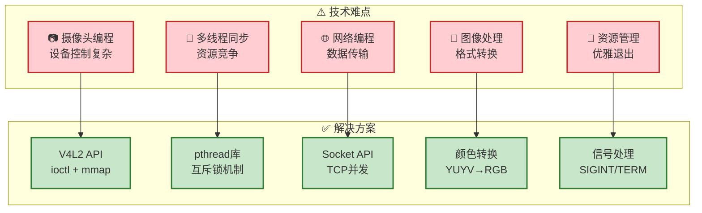

| 技术难点   | 解决方法     | 技术要点            |
| ---------- | ------------ | ------------------- |
| 摄像头编程 | V4L2 API学习 | ioctl控制、mmap映射 |
| 多线程同步 | pthread库    | 互斥锁、线程创建    |
| 网络编程   | Socket API   | TCP服务器、并发连接 |
| 图像处理   | 颜色转换算法 | YUYV→RGB公式        |
| 资源管理   | 信号处理     | SIGINT/SIGTERM      |

---

## 六、学习总结

### 6.1 技术能力提升

**1. 嵌入式Linux开发**
- ✅ 掌握ARM开发板的交叉编译环境配置
- ✅ 熟悉Linux设备文件操作（/dev/video、/dev/fb、/dev/input）
- ✅ 理解framebuffer显示原理
- ✅ 掌握V4L2视频采集框架

**2. 网络编程**
- ✅ 深入理解TCP/IP协议栈
- ✅ 掌握Socket编程（bind、listen、accept、send、recv）
- ✅ 实现可靠的数据传输机制
- ✅ 学会处理网络异常和断连情况

**3. 多线程编程**
- ✅ 掌握POSIX线程（pthread）使用
- ✅ 理解线程同步和互斥锁机制
- ✅ 解决资源竞争和死锁问题
- ✅ 实现并发服务器架构

**4. 系统编程**
- ✅ 理解进程信号处理机制
- ✅ 掌握文件I/O和内存映射（mmap）
- ✅ 学会系统调用的使用（ioctl、open、close等）
- ✅ 熟悉指针操作和内存管理

**5. 图像处理**
- ✅ 了解常见图像格式（YUYV、RGB、BMP）
- ✅ 掌握颜色空间转换算法
- ✅ 实现图像数据的读取和写入
- ✅ 理解像素点操作原理

### 6.2 工程能力提升

**1. 软件工程实践**
- ✅ 模块化设计思想
- ✅ 代码规范和注释习惯
- ✅ 头文件和源文件组织
- ✅ Makefile编写和项目构建

**2. 调试能力**
- ✅ 使用printf调试定位问题
- ✅ 分析系统错误信息（perror）
- ✅ 网络抓包和协议分析
- ✅ 内存泄漏检测方法

**3. 文档编写**
- ✅ 技术文档撰写能力
- ✅ 代码注释和API说明
- ✅ 问题分析和解决方案记录
- ✅ 项目总结和知识沉淀

**4. 团队协作**（如适用）
- 代码版本控制
- 分工合作和模块对接
- 技术问题讨论和解决
- 代码审查和优化

### 6.3 理论知识应用

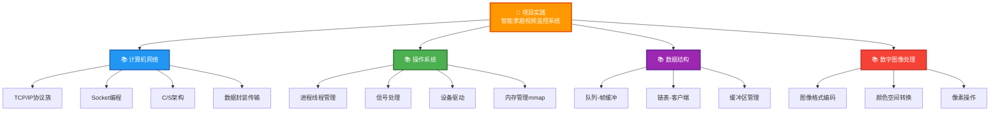

本项目将以下课程理论应用于实践：

**《计算机网络》**
- TCP/IP协议族
- 套接字编程
- 客户端-服务器架构
- 网络数据封装和传输

**《操作系统》**
- 进程和线程管理
- 信号处理机制
- 文件系统和设备驱动
- 内存管理（mmap）

**《数据结构》**
- 队列结构（帧缓冲队列）
- 链表管理（客户端列表）
- 缓冲区管理

**《数字图像处理》**
- 图像格式和编码
- 颜色空间转换
- 像素操作

### 6.4 个人成长与反思

**收获：**
1. **系统思维：** 学会从整体架构出发设计系统，考虑模块间的交互和依赖关系
2. **问题解决：** 提高了独立分析和解决技术问题的能力
3. **实践能力：** 将理论知识转化为实际应用的能力显著提升
4. **耐心细致：** 嵌入式开发需要大量调试，培养了细心和耐心的品质

**不足与改进方向：**
1. **性能优化：** 当前实现未充分考虑性能优化，如可以使用硬件编码（H.264）减少带宽占用
2. **错误处理：** 部分错误处理还不够完善，需要增强容错性
3. **功能扩展：** 可以增加录像、回放、移动侦测等高级功能
4. **代码质量：** 部分代码可以进一步重构，提高可读性和可维护性

---

## 七、未来展望

### 7.1 功能扩展方向

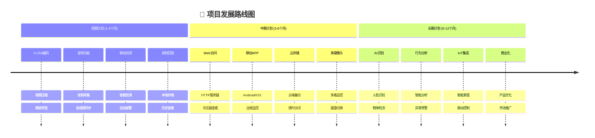

**短期计划（1-3个月）：**
- [ ] 实现H.264视频编码，降低网络带宽需求
- [ ] 添加音频采集和传输功能
- [ ] 实现移动侦测和自动报警
- [ ] 支持视频录制和回放

**中期计划（3-6个月）：**
- [ ] Web界面远程访问
- [ ] 移动端APP开发（Android/iOS）
- [ ] 云端存储集成
- [ ] 多摄像头支持

**长期计划（6-12个月）：**
- [ ] AI人脸识别功能
- [ ] 智能行为分析
- [ ] IoT平台集成
- [ ] 商业化应用探索

### 7.2 技术优化方向

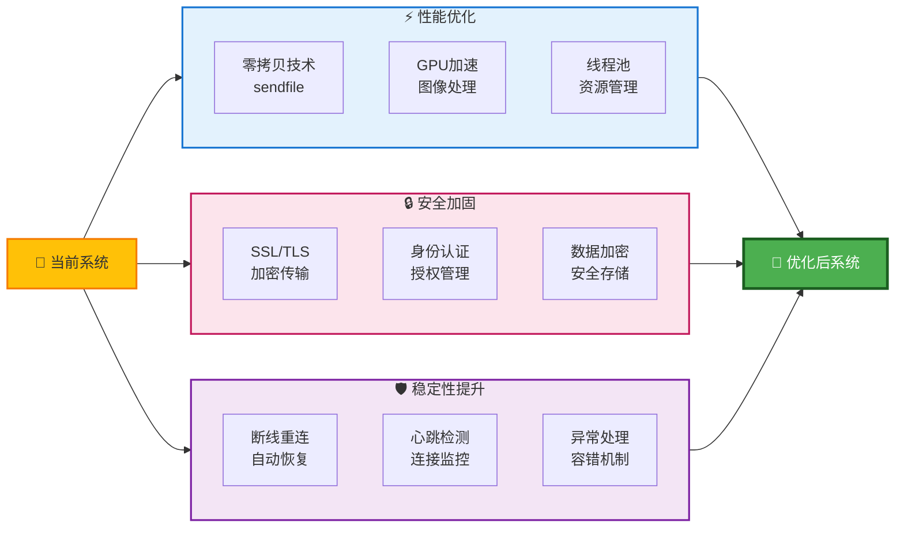

**1. 性能优化**
   - 使用零拷贝技术（sendfile）
   - GPU加速图像处理
   - 多线程池管理

**2. 安全加固**
   - SSL/TLS加密传输
   - 用户认证和授权
   - 数据加密存储

**3. 稳定性提升**
   - 断线重连机制
   - 心跳检测
   - 异常自动恢复

---

## 八、致谢

感谢指导老师在项目开发过程中的悉心指导和帮助，感谢同学们的讨论和建议。通过本项目的实践，我深刻理解了网络程序设计的核心思想，为未来的学习和工作打下了坚实的基础。

---

## 附录

### A. 项目文件结构

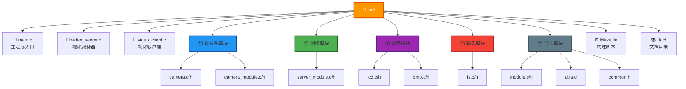

**文件清单：**
```
src/
├── main.c                  # 主程序入口
├── video_server.c          # 视频服务器实现
├── video_client.c          # 视频客户端实现
├── camera.c/camera.h       # 摄像头驱动
├── camera_module.c/h       # 摄像头模块
├── server_module.c/h       # 服务器模块
├── lcd.c/lcd.h            # LCD显示
├── bmp.c/bmp.h            # BMP图像处理
├── ts.c/ts.h              # 触摸屏
├── utils.c                 # 工具函数
├── module.c/module.h       # 模块管理
├── common.h                # 公共头文件
├── Makefile                # 构建脚本
└── doc/                    # 文档目录
```

### B. 编译和运行

**编译服务器端：**
```bash
make server
```

**编译客户端：**
```bash
make client
```

**运行服务器：**
```bash
./video_server
```

**运行客户端：**
```bash
./video_client <服务器IP> 8888
```

### C. 关键参数配置
```c
#define FRAME_WIDTH  640      // 视频宽度
#define FRAME_HEIGHT 480      // 视频高度
#define SERVER_PORT  8888     // 服务器端口
#define BUFFER_COUNT 4        // 缓冲区数量
```

---

**文档版本：** V1.0  
**最后更新：** 2025年10月19日  
**项目状态：** ✅ 已完成  
**答辩准备：** ✅ 就绪
